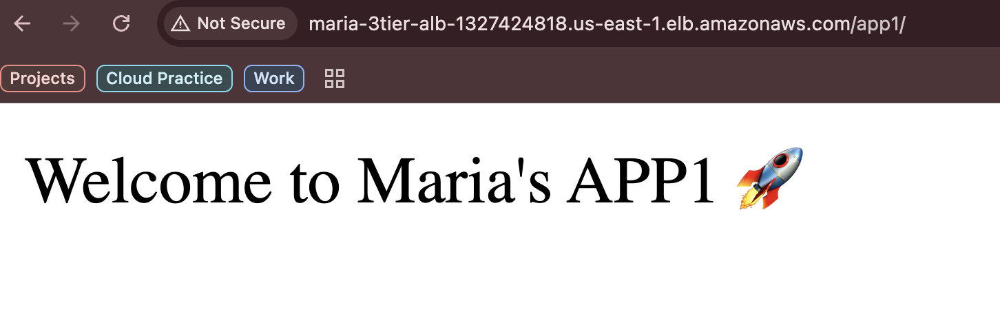
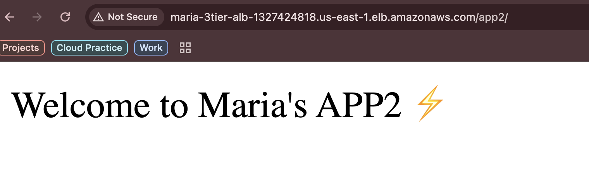
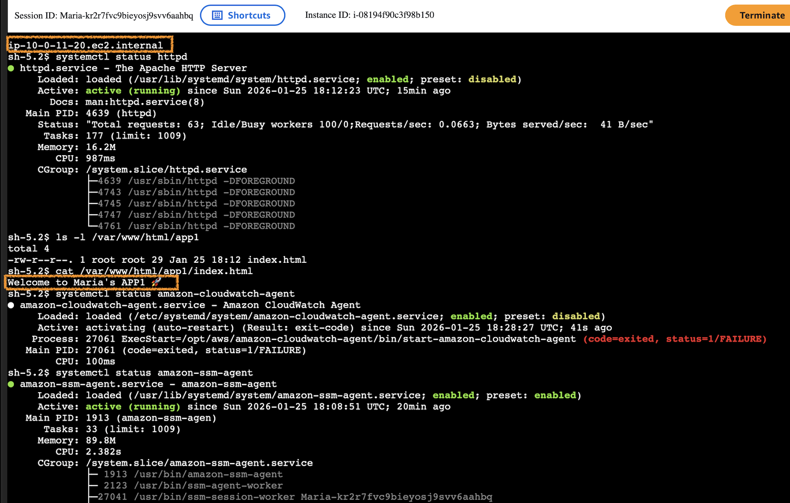
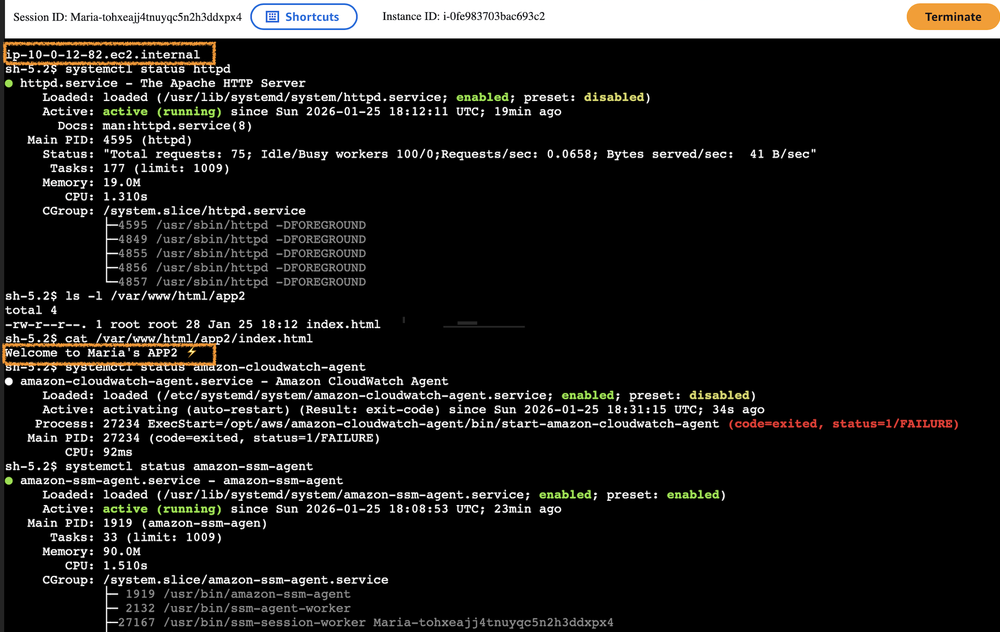
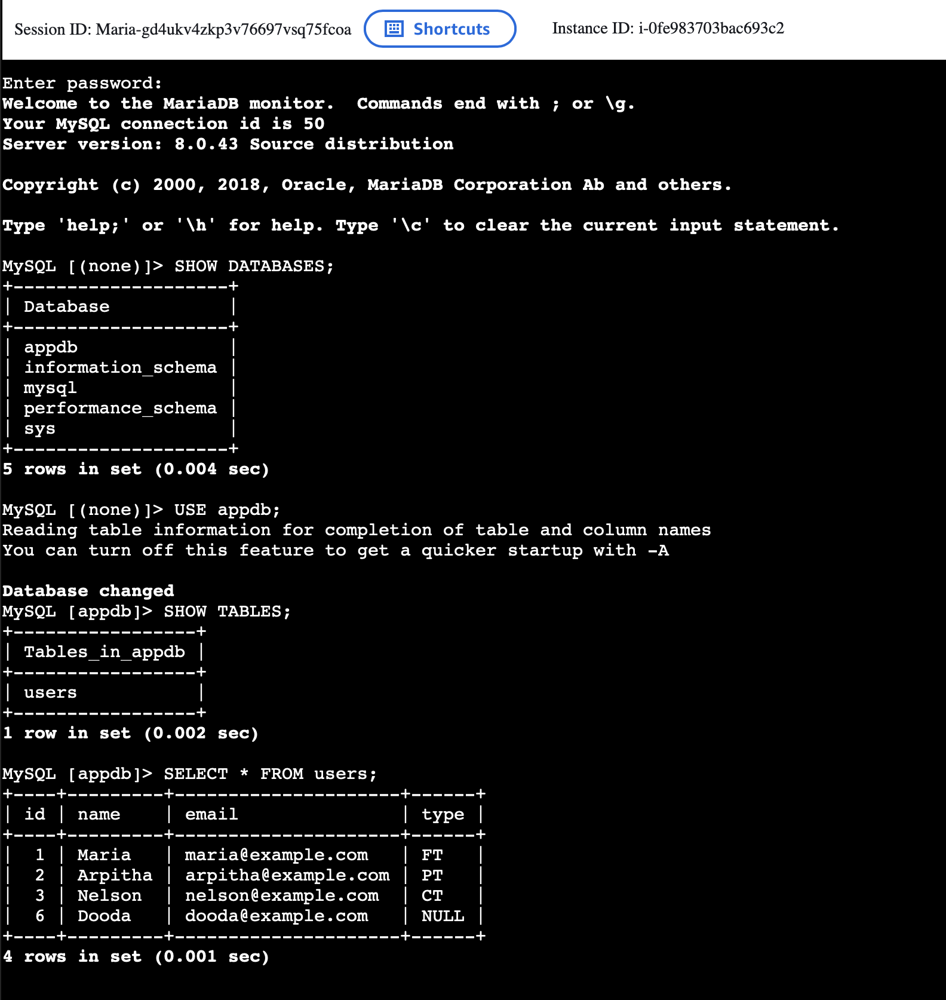
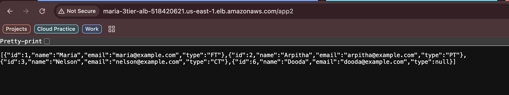
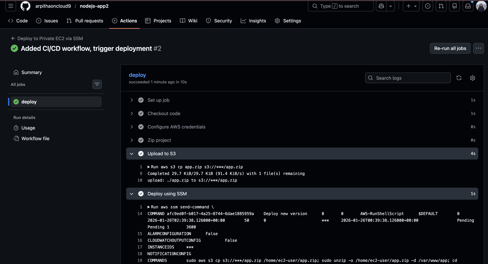

# **Production‑Grade AWS 3‑Tier Architecture with Terraform, EC2 Auto Scaling, RDS, ALB & GitHub Actions CI/CD**

This project demonstrates a complete **production‑style 3‑tier architecture** on AWS, fully automated using **Terraform** and integrated with a **zero‑touch CI/CD pipeline** using GitHub Actions, S3, and SSM. It covers networking, compute, database, application deployment, monitoring, and automated delivery.

# **Architecture Overview**

## ** Tier‑1: Networking Layer (Day‑1)**

Built the foundational AWS network using Terraform:

- Custom **VPC**
- **6 subnets** (Public, Private App, Private DB across 2 AZs)
- **Internet Gateway** for public access
- **NAT Gateway** for private outbound traffic
- **Route tables** for each tier
- **S3 VPC Endpoint** for private S3 access

**Outcome:** A secure, multi‑AZ network foundation for all application layers.

## ** Tier‑2: Compute Layer (Day‑2)**

Provisioned the full compute stack:

- **Application Load Balancer (ALB)**
- **Target Group** with health checks
- **Launch Template** for consistent EC2 configuration
- **Auto Scaling Group (ASG)** across private subnets
- **Security Groups** enforcing ALB → EC2 traffic
- **User Data** to bootstrap the app
- **Path‑based routing** (`/app1`, `/app2`)
- **SSM Agent** + **CloudWatch Agent** installed
- **IAM instance profile** for S3, SSM, CloudWatch access

**Outcome:** Highly available, scalable, secure compute layer.

##### Application Validation

Successfully deployed App1 and App2 with ALB path-based routing, custom welcome pages.

##### Instance Connection via SSM Session Manager

This screenshot confirms that the EC2 instance is running the Apache HTTP Server, serving content from /var/www/html/app1, /var/www/html/app2 and is securely accessed using SSM Session Manager.
It also shows that the SSM Agent is active, while the CloudWatch Agent is installed but not yet running, providing visibility into system-level service health and monitoring setup.

 

## ** Tier‑3: Database Layer (Day‑3)**

Configured a secure MySQL database:

- **Amazon RDS MySQL** in private DB subnets
- **Automated backups** enabled
- **DB subnet group** for multi‑AZ placement
- **SG‑to‑SG access** (EC2 → RDS only)
- Connected via **SSM Session Manager**
- Validated using MySQL client from EC2

**Outcome:** A secure, private, production‑ready database layer.

This image illustrates how the EC2 instance connects to the RDS database securely using SSM Session Manager.

## ** Application Layer Integration (Day‑4)**

Deployed and validated the backend application:

- Node.js app deployed on private EC2
- Managed with **PM2**
- ALB → EC2 → RDS full flow validated
- CloudWatch metrics enabled
- IAM permissions for S3 + SSM
- End‑to‑end request flow tested

**Outcome:** Fully functional application tier integrated with ALB and RDS.

##### App2 Backend Validation — ALB Path /app2

Successfully retrieved structured JSON data from the Node.js backend via ALB path /app2, confirming EC2 → RDS connectivity.

## ** CI/CD Pipeline Automation (Day‑5)**

Built a zero‑touch deployment pipeline:

- **GitHub Actions** workflow triggered on push
- App packaged and uploaded to **S3**
- **SSM Run Command** deploys to private EC2
- PM2 restarts the app automatically
- No SSH, no public IPs — fully secure

**Outcome:** Production‑style CI/CD pipeline delivering automated deployments into private EC2 instances.

##### CI/CD Workflow: Node.js App2 Deployment via GitHub Actions

This screenshot confirms successful deployment of app2 using a fully automated CI/CD pipeline.
The workflow includes code checkout, AWS credential configuration, project packaging, S3 upload, and remote deployment via SSM Run Command, ensuring zero manual intervention and secure delivery to EC2.

##  **End‑to‑End Flow**

1. User hits ALB DNS
2. ALB routes traffic (`/app1`, `/app2`)
3. EC2 processes request in private subnet
4. App connects to RDS for data
5. Response flows back through ALB
6. CI/CD updates app automatically on code push

##  **Technologies Used**

- **AWS:** VPC, EC2, ALB, ASG, RDS, S3, IAM, SSM, CloudWatch
- **Terraform:** Infrastructure as Code
- **GitHub Actions:** CI/CD automation
- **Node.js + PM2:** Application runtime
- **SSM Session Manager:** Secure access (no SSH)

##  **Key Features**

- Fully private compute + database layers
- Zero‑touch deployments
- Multi‑AZ high availability
- Secure SG‑to‑SG communication
- Monitoring + logging enabled
- Terraform‑driven reproducible infrastructure

##  **Project Outcome**

This project demonstrates hands‑on experience with:

- Cloud architecture design
- Infrastructure as Code
- Secure networking
- Scalable compute
- Database provisioning
- Application deployment
- CI/CD automation

It mirrors how real production systems are built and operated in AWS.
